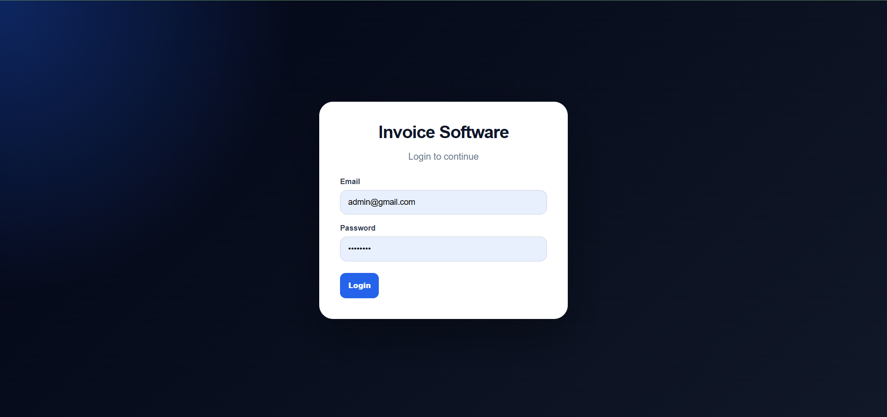
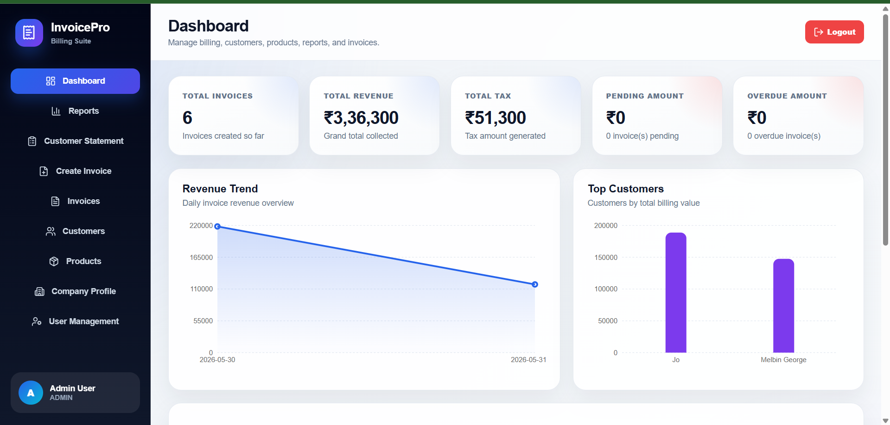
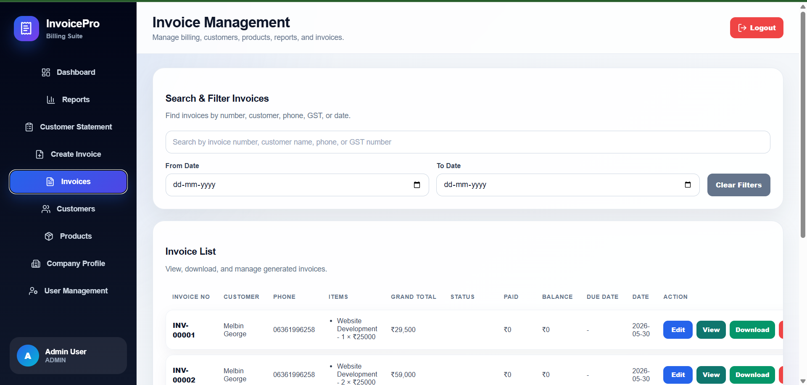
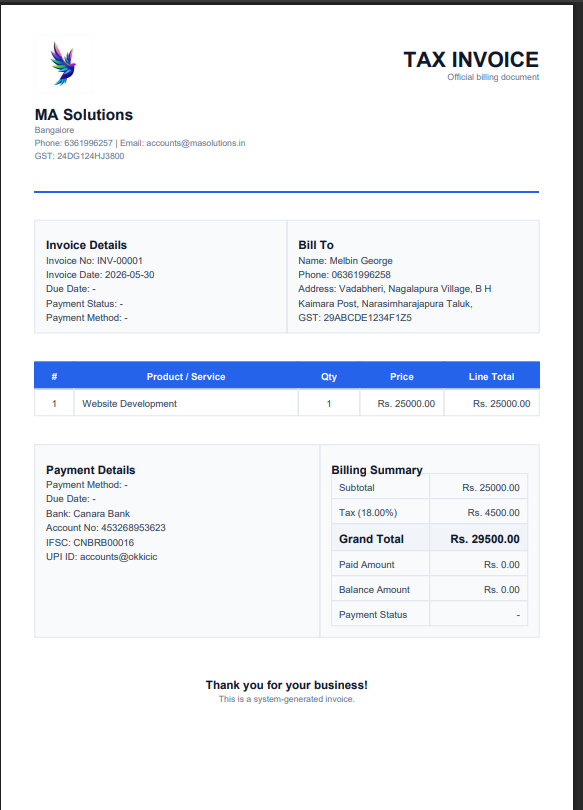
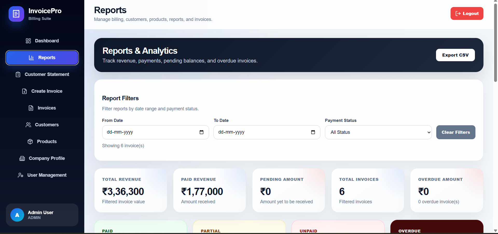

# Invoice Software

[](https://invoice-software-zeta.vercel.app/)

A polished full-stack invoice management and billing application built with **Spring Boot**, **React**, **MySQL**, **JWT Authentication**, **PDF generation**, and **role-based access control**.

This system enables businesses to manage invoices, customers, products, payments, reports, overdue invoices, and branding through a company profile.

> 🌐 **Deployed application:** [https://invoice-software-zeta.vercel.app/](https://invoice-software-zeta.vercel.app/)

---

## 🚀 Key Features

- JWT-powered authentication with Admin and Staff roles
- Role-based access control in UI and backend
- Invoice creation, editing, deletion, and PDF export
- Multiple invoice items with tax, discount, payment status, and due date support
- Payment recording with partial payment handling
- Customer and product master data management
- Company profile with logo upload and invoice branding
- Dashboard analytics with charts and overdue summaries
- Reports with CSV export and date/status filters
- Customer statements with billing history and outstanding amounts

---

## 🧱 Tech Stack

### Backend
- Java 21
- Spring Boot 7
- Spring Security
- JWT Authentication
- Spring Data JPA / Hibernate
- MySQL
- OpenPDF
- Maven

### Frontend
- React 19
- Vite
- Axios
- Recharts
- Lucide React
- React Hot Toast
- CSS

---

## 📁 Project Structure

```text
Invoice_Software/
├── frontend/
│   ├── public/
│   ├── src/
│   │   ├── api/
│   │   ├── assets/
│   │   ├── components/
│   │   ├── pages/
│   │   └── utils/
│   ├── package.json
│   └── vite.config.js
├── invoice-software-backend/
│   ├── src/main/java/com/example/invoiceapp/
│   │   ├── config/
│   │   ├── controller/
│   │   ├── dto/
│   │   ├── entity/
   │   ├── repository/
   │   ├── security/
   │   └── service/
│   ├── src/main/resources/
│   └── pom.xml
└── README.md
```

---

## ⚙️ Setup Instructions

### 1. Backend Setup

1. Open a terminal in `invoice-software-backend`
2. Create a MySQL database:

```sql
CREATE DATABASE invoice_db;
```

3. Update database settings in `invoice-software-backend/src/main/resources/application.properties`

Example:

```properties
spring.datasource.url=jdbc:mysql://localhost:3306/invoice_db
spring.datasource.username=root
spring.datasource.password=your_password
```

4. Run the backend:

```powershell
cd invoice-software-backend
.\mvnw.cmd spring-boot:run
```

> The backend exposes the REST API and handles authentication, invoice processing, PDF generation, and database operations.

### 2. Frontend Setup

1. Open a terminal in `frontend`
2. Install dependencies:

```powershell
cd frontend
npm install
```

3. Start the development server:

```powershell
npm run dev
```

> The React frontend communicates with the Spring Boot backend via Axios and provides the application UI.

---

## 🧪 Default Login Accounts

The application creates default user accounts on first startup.

- **Admin**
  - Email: `admin@gmail.com`
  - Password: `admin123`
  - Role: `ADMIN`

- **Staff**
  - Email: `staff@gmail.com`
  - Password: `staff123`
  - Role: `STAFF`

---

## 🔐 Role Permissions

| Feature            | Admin | Staff |
| ------------------ | :---: | :---: |
| Dashboard          | Yes   | Yes   |
| Reports            | Yes   | Yes   |
| Customer Statement | Yes   | Yes   |
| Create Invoice     | Yes   | Yes   |
| View Invoice       | Yes   | Yes   |
| Download PDF       | Yes   | Yes   |
| Mark Payment       | Yes   | Yes   |
| Edit Invoice       | Yes   | No    |
| Delete Invoice     | Yes   | No    |
| Customer Master    | Yes   | No    |
| Product Master     | Yes   | No    |
| Company Profile    | Yes   | No    |
| User Management    | Yes   | No    |

---

## � Screenshots

Below are the core screens for the invoice application. The images are stored in the repository under `screenshots/` and referenced relative to this README.

### Login Screen



### Dashboard



### Invoice List



### Invoice PDF Preview



### Reports



---

## 💡 Notes

- Ensure MySQL is running before starting the backend.
- If the frontend fails to connect, verify the backend API URL and CORS configuration.
- Replace default credentials after the first login for production use.

---

## 📌 Recommended Improvements

- Add environment-specific configuration for frontend and backend
- Enable HTTPS for production deployment
- Add unit and integration tests for backend and frontend

---

## 📦 Run Summary

- Backend: `invoice-software-backend/` using Maven
- Frontend: `frontend/` using Vite
- Database: MySQL

---

## 🌱 Future Enhancements

- Email invoice to customer
- WhatsApp invoice sharing
- Backup and restore
- Expense tracking
- Profit/loss dashboard
- Invoice number settings
- Multi-company support
- Cloud deployment

---

## 🧑‍💻 Author

- **Melbin George**
- GitHub: [@melbingeorge23](https://github.com/melbingeorge23)

---

## 📄 License

This project is for learning, portfolio, and business software development practice.